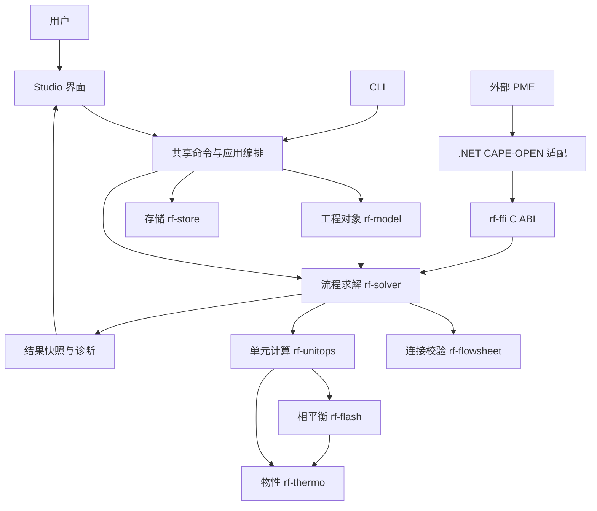

# Architecture Overview

更新时间：2026-09-29

## 用途

用途：说明仓库实际分层、稳定边界、已实现能力与尚未落地的目标边界。
读者：需要定位模块职责、追踪依赖或判断架构现状的维护者。
不包含：逐日开发流水、命令级验证记录、完整接口设计和产品排期。

本文区分架构目标与已有实现，后续开发按稳定分层逐步补齐差异。当前迭代优先级见 [当前状态](../status/current.md)。

长期定位已扩展为覆盖稳态、动态、瞬态与多种求解策略的流程模拟平台。组分、物性分析、画布、单元 / 反应、运行、算法、报告和统一 API 的职责与扩展契约见 [模拟平台长期规划](simulation-platform.md)。本文继续如实记录现有实现，不以目标能力替换当前 crate 职责；近期按基础功能闭环逐步改善依赖与状态边界。

## 系统组成与实际状态

| 部分 | 已有实现 | 能力边界 |
| --- | --- | --- |
| Rust Core | 对象模型、简化物性、TP Flash、受控单元、图校验和顺序模块求解 | 二元 MVP 与无回路小流程；算法收敛不等于物理准确性验证 |
| Rust Studio | `eframe/egui` 桌面壳、草稿与命令、运行控制、结果审阅、项目生命周期 | 受控建模路径，尚非完整自由连线或通用流程编辑器 |
| .NET 10 CAPE-OPEN Bridge | C ABI 调用、PMC、注册工具、contract / smoke 与 SampleHost | 自有 Unit Operation PMC；PME 兼容结论限于已记录的宿主和场景 |
| 外部 Control Plane | 本仓库已有客户端 DTO、HTTP transport、缓存与租约编排 | 服务端未在本仓库落地；客户端测试不代表 OIDC、部署和真实授权闭环已完成 |

已有小流程覆盖 `Feed -> Flash Drum`、`Feed -> Heater/Cooler/Valve -> Flash Drum`、`Feed + Feed -> Mixer -> Flash Drum`。用户路径和验收证据分别见 [Studio 主路径](../topics/studio-main-workflow.md) 与 [MVP β 验收记录](../mvp/beta-acceptance-checklist.md)。

## 用户入口与计算关系

用户通过 Studio 或 CLI 提交操作；应用编排负责命令、工程修订、运行和存储，工程模型描述单元与流股，流程求解器负责依赖和执行，单元调用热力学服务。单位、错误、诊断和存储是横向能力，不必组成只能逐层向下调用的阶梯。账户 / 授权控制能力访问，不拥有物流或设备方程。

图为主要职责 / 数据关系，不是完整依赖图。当前命令和查询分布于 `rf-ui` 与 Studio，尚非独立应用服务包；现有 FFI 求解入口也不代表全部 Studio 编辑动作已对外开放。画布图元、工程中的 `UnitNode`、执行 `UnitOperation` 的计算对象分别承担呈现、持久配置和计算职责。

## Rust 模块职责

| 模块 | 实际职责 | 说明 |
| --- | --- | --- |
| `rf-types` | ID、相标签、错误与诊断上下文、相区容差及量 / 单位目录与转换 | 单位基础无 UI、IO 或 COM 语义；规范 SI 不变 |
| `rf-model` | 组分、流股、单元、端口和 flowsheet 对象模型 | 不负责求解调度 |
| `rf-thermo` | Antoine、理想 K 值、常热容相焓、泡露点估算、物性 provider | 目前还含缓存包装载，见下方依赖偏移说明 |
| `rf-flash` | TP Flash、Rachford-Rice、相分率与相组成 | 数值假设与验证边界见 [热力学模型](../thermo/mvp-model.md) |
| `rf-unitops` | canonical ports、单元输入输出、Feed / Mixer / Heater / Cooler / Valve / Flash Drum 行为 | Mixer、Valve 和焓模型使用 MVP 简化假设 |
| `rf-flowsheet` | 端口、流股引用和一股一源一汇连接校验 | 终端产品流可没有 sink |
| `rf-solver` | 无回路顺序模块执行、步骤快照、诊断 | 环路报错，不代表已有 recycle 收敛器 |
| `rf-store` | 项目、sidecar、偏好、授权缓存和物性包 DTO 的序列化与文件 IO | 具有版本检查和 staged write；失败恢复限制见 [存储专题](../topics/project-lifecycle-storage.md) |
| `rf-ffi` | engine 句柄、JSON 输入输出、错误映射与字符串释放 | 对外只暴露窄 C ABI，不向内核引入 COM |
| `rf-ui` | AppState、草稿、共享输入事务、变量查询、历史与结果 presentation | 只读消费求解结果，不另算热力学 |
| `rf-canvas` | 当前只有占位函数 | 尚未成为实际独立画布实现 |
| `apps/radishflow-studio` | 应用组合、受控动作、CLI 消费者、GUI 渲染与平台 IO | 当前画布代码位于 Studio，而非 `rf-canvas` |
| `tests/rust-integration` | 示例流程与 Studio / solver 的跨层回归 | 结果传递一致性与独立数值准确性是不同验证目标 |
| `xtask` | 仓库治理、文本门禁和 Rust 基线检查 | `.sh` / `.ps1` 是平台包装入口 |

典型计算调用方向为 `Studio 或 rf-ffi -> rf-solver -> rf-unitops -> rf-flash / rf-thermo`；`rf-flowsheet` 提供连接校验，`rf-model / rf-types` 提供领域数据。该描述是职责路径，不是完整 Cargo 依赖图。

后续多策略目标采用“同一工程 → 计算任务 → 能力 / 规格检查 → 问题装配 → 分块执行 → 统一结果”。当前 `FlowsheetSolver` 和 `UnitOperation::run` 不代表已有通用方程装配器；SM、联立模块、EO 的能力与运行边界见 [多策略专题](../topics/modeling/solver-strategies-and-assembly.md)，具体 crate 和接口尚未冻结。

## 模型发现与装配现状

| 方向 | 当前实现 | 限制 |
| --- | --- | --- |
| 内建单元 | `BuiltinUnitKind / UnitOperationSpec` 静态定义，solver 的 `instantiate_operation` 按 kind 构造 | 六类固定模型，不扫描插件或加载第三方库 |
| 物性包 | `PropertyPackageProvider` 枚举 manifest 并装载 `ThermoSystem` | 当前 Studio 仍构造固定物性 / TP Flash 实现；数据包不是通用可执行插件 |
| 物性绑定 | 流程保存一个 package ID，单次求解注入一套服务 | 尚无完整工段 / 单元多物性绑定 |
| 对外 CAPE-OPEN | 外部 PME 发现和调用自有 Unit Operation PMC | 与 RadishFlow 加载外部 PMC 的宿主方向不同，后者未实现 |

模型定义、工程实例、运行实例及目录 / 工厂的演进和验收见 [模型目录专题](../topics/modeling/model-catalog-and-runtime.md)。静态装配是当前合理起点，但 `UnitOperation` 的固定枚举和温压参数结构尚不是开放模型协议。

## 稳定边界与实现偏移

### Core 与持久化

目标边界仍是：热力学计算与 provider 接口不承担网络、授权流程或文件缓存编排；缓存布局和持久化属于 `rf-store`，应用层负责组合。

实际 [CachedPropertyPackageProvider](../../crates/rf-thermo/src/lib.rs) 位于 `rf-thermo`，直接依赖 `rf-store`，读取授权缓存记录、判断到期时间并装载 manifest / payload。这是尚未消除的目标与实现偏移，不应表述为纯计算层隔离已经完成。

该边界按 [MC2](../topics/modeling/model-catalog-and-runtime.md#分阶段切片) 规划将装载与 DTO 转换归于应用装配或明确的加载职责，让计算层接收已解析数据。方向已确认，具体模块拆分仍在实施切片决定，当前依赖未改变。

### 文档、编辑与结果

- `FlowsheetDocument` 是项目语义真相源，字段草稿通过正式 `DocumentCommand` 提交。
- `CommandHistory` 当前保存 before / after flowsheet 快照用于 undo / redo；相同有效输入不新增历史或修订。
- `SolveSnapshot` 与文档分离，按 revision 判断是否过期；UI 和导出不重新计算相态与焓值。
- 项目使用 `*.rfproj.json`，布局使用 `<project>.rfstudio-layout.json`；授权缓存与 token 不进入项目文件。
- Studio 已内嵌 Inter / SourceHanSansSC 字体，不依赖固定的系统 CJK 字体名称。

变量查询 / 写入置于 `rf-ui`，受控创建 / 连接 / 运行调用和本地 CLI 置于 Studio 应用层。CLI 复用现有事务与运行链路，不启动窗口；仍链接桌面依赖。接口范围见 [无界面参考](../reference/headless-cli.md)。

U1 的公共单位定义与转换位于 `rf-types::units`；`rf-ui` 变量元数据引用量类型。U2 已接通项目呈现保存、个人默认、数值会话及首批控件 / 视图覆盖，剩余交互与验收见 [单位专题](../topics/units-and-quantity-system.md)；CLI 保持规范 SI 契约。

详细状态与交互契约见 [App Architecture](app-architecture.md)；字段与结果语义见 [结果参考](../reference/solve-snapshot-results.md)。

### Rust 与 CAPE-OPEN

Rust 不处理 COM、`IDispatch`、`VARIANT` 或 `SAFEARRAY`。互操作仅通过句柄、基础数值、UTF-8 和 JSON。`.NET` 负责 marshalling、ECape 异常、宿主生命周期与注册。

Bridge 包含 Interop、Adapter、UnitOp.Mvp、Registration、ContractTests、SmokeTests 与 SampleHost。真实注册保持 dry-run / preflight / 显式执行门控。已有 DWSIM / COFE 验证不等于所有 PME 或任意线程调用均已受支持；native 句柄生命周期契约见 [适配层专题](../topics/capeopen-pmc-adapter.md)。官方接口和验证入口见 [CAPE-OPEN 边界](../capeopen/boundary.md) 与 [PME runbook](../capeopen/pme-validation.md)。

### 外部控制面

历史目标采用 OIDC Authorization Code + PKCE、`.NET 10` 控制面和派生物性资产分发，本地求解热路径不改为远端 RPC。已存在的客户端与缓存编排不表示服务端、身份安全存储集成或真实业务授权已经交付。

[认证授权架构](auth-entitlement-architecture.md) 保留目标契约；[控制面专题](../topics/platform/control-plane-service.md) 记录未实现部分。当前不扩展该方向。

## 已确认的规划扩展

[单位系统](../topics/units-and-quantity-system.md)、[规格与建模辅助](../topics/modeling-assistance-and-specifications.md)、[设备工程](../topics/equipment-design-and-rating.md) 于 2026-09-16 纳入规划。单位和规则由可供非 UI 消费者复用的领域边界拥有，设备独立计算与流程集成共用模型；具体 crate、接口和存储在真实切片决定，本表不登记不存在的模块。未来 Agent 复用同一入口，当前不接入 AI。

[UI 功能分区重评](studio-ui-topic-plan.md) 不改变文档 / 命令 / 结果的单一来源；旧主稿不自动授权新设备页面或全界面代码重写。

## 维护性观察

Studio 已形成多层 host / driver / runtime / snapshot / window model，以便测试交互和平台状态。实际仍有大型实现与测试文件，以及同步求解路径；不能从层数推导出异步能力或性能保证。

若以后允许调整实现，应先按真实用户行为审查调用链：保留有独立状态、平台隔离或跨消费者契约的层，评估纯转发和重复投影；按领域职责组织大文件与测试，不做机械切片。后台求解、取消、过期结果丢弃与快照成本应结合实际负载评估，当前没有由本次审阅得到的性能测量结论。

维护优先级只由 [当前状态](../status/current.md) 管理。原始里程碑、Studio / CAPE-OPEN 计划演进见 [历史路线图](../radishflow-mvp-roadmap.md) 及 [周志索引](../devlogs/README.md)，不在架构入口重复维护。
