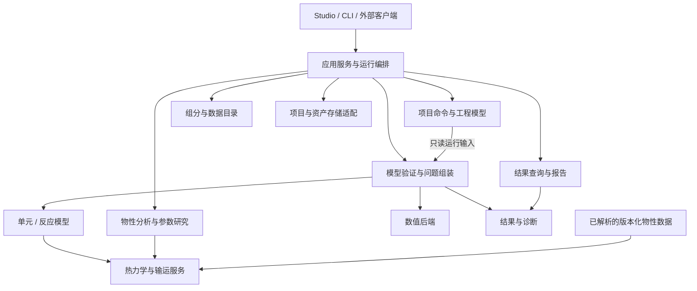

# 可扩展流程模拟平台长期规划

更新时间：2026-09-13

## 用途与决策状态

用途：定义 RadishFlow 的长期产品目标、领域子系统、计算模式与可扩展边界，指导基础功能的持续建设。
读者：规划产品、设计领域模型、实现计算与应用接口的项目所有者和协作者。
不包含：已交付能力声明、精度认证、完整 API / 项目格式定义、依赖选型或逐项发布日期。

2026-09-13 项目所有者明确：近期先完善基础功能与使用闭环，长期建设覆盖稳态、动态、瞬态和间歇流程、多种求解组织方式的流程模拟平台，并借鉴下文列出的商业与开放产品。后续补充明确了递归分块求解、变量树式统一 API、COM 自动化和操作录制 / 回放目标。本文将这些方向落实为目标架构；阶段顺序见 [路线图](../radishflow-mvp-roadmap.md)，当前任务见 [当前状态](../status/current.md)，实际实现见 [架构总览](overview.md)。

产品方向与分层原则已确定；下文的能力契约是设计要求，尚未冻结具体 Rust trait、C ABI、插件协议或存储 schema。后续在真实功能切片中设计和验证接口，不提前创建空 crate、万能接口或全部后台服务。

## 产品目标与使用方式

RadishFlow 以 Rust Core、Rust Studio 和独立互操作适配层构建可组合的流程模拟平台。从可用的稳态建模工作台起步，逐步服务工艺开发、设计与校核、装置分析、控制与开停车研究、管网瞬态分析及自动化计算。

长期应支持多种独立使用路径：

- 查找、比较和建立组分数据，不必先创建流程图。
- 对纯组分或混合物进行物性分析、参数估算和数据回归，不必启动 Studio 画布。
- 单独计算或校核一个设备，或将其组装成流程与子流程。
- 对同一工程模型建立稳态案例、动态实验、间歇 / 半间歇配方和参数研究，明确各自的补充输入与支持范围。
- 从统一变量 / 动作树浏览软件公开的工程能力，通过桌面、COM、命令行或脚本创建模型、填写参数、检查自由度、运行和读取结果。
- 录制已提交的操作，生成可编辑、可参数化的脚本并回放重复工况；文档撤销与运行重启保留各自的状态边界。

核心产品质量包括可理解、可组合、可诊断、可复现和可扩展。工程可信度随模型与数据逐项建立，不由功能数量、品牌对标或测试数量代替。

## 产品与技术参考

以下参考于 2026-09-13 查阅官方公开资料。第二列仅概括公开能力，第三列是 RadishFlow 的设计取舍，不声称掌握商业软件内部架构、算法或实现。Aspen 主要以 Aspen Plus 为参考，KBC 主要以 Petro-SIM / Reactor Suite 为参考；APC 暂按 Advanced Process Control（先进过程控制）能力领域理解，尚未指定某个同名产品。

| 参考 | 官方资料呈现的能力 | RadishFlow 重点吸收的思路 |
| --- | --- | --- |
| [Aspen Plus](https://www.aspentech.com/en/products/engineering/aspen-plus) | 物性数据、广泛的过程模型及经济、能源、安全和排放分析 | 组分与物性工作环境、模型选择与分析工具、工艺计算和工程研究衔接 |
| [Aspen HYSYS Dynamics](https://home.aspentech.com/en/products/engineering/aspen-hysys-dynamics) | 稳态到动态的工作流，控制、开停车与扰动研究 | 清楚的输入完整性和运行反馈，稳态与动态共享可复用工程数据，转换前显式检查新增条件 |
| [AVEVA PRO/II](https://www.aveva.com/en/products/pro-ii-simulation/) | 稳态热量与物料衡算、组分和物性库、设备模型、外部工具与报告集成 | 工程输入组织、计算状态检查、完整物料与能量结果、可复核报告 |
| [KBC Petro-SIM](https://www.kbc.global/process-optimization/technology/simulation-software/petro-sim-simulation-software/) / [Reactor Suite](https://www.kbc.global/process-optimization/technology/simulation-software/petro-sim-reactor-suite/) | 炼化及全厂过程模型、专用反应器、用数据调整模型与比较工况 | 通用平台与行业模型包分层，油品表征、模型标定和装置数据对照形成闭环 |
| [SLB OLGA](https://www.slb.com/products-and-services/delivering-digital-at-scale/software/olga) | 管道和井筒多相瞬态、开停工与流动保障，并持续使用实验和现场数据验证 | 将空间分布、积存、边界条件与瞬态事件作为独立建模需求，建立相应实验和数值基准 |
| [Honeywell UniSim Design](https://process.honeywell.com/us/en/products/industrial-software/process-optimization/unisim-design-suite) / [产品组成](https://process.honeywell.com/us/en/initiative/unisim-design-suite/unisim-products) | 稳态与动态工作环境、物性分析与回归，Python / .NET API | 交互建模、物性工作台、稳态到动态的补充输入检查和外部自动化 |
| [CHEMCAD](https://chemstations.com/Industries/Chemical_Processing/) | 热力学、敏感性与优化，间歇反应和间歇精馏的动态建模应用 | 连续与间歇操作共用工程基础，设备行为与操作步骤分别建模 |
| [ProMax Workflow Solutions](https://www.bre.com/ProMax-WorkFlow-Solutions.aspx) | Excel / VBA 工作流、物性调用、Scenario Tool 多工况分析 | 参数化案例、外部计算驱动、批量工况与报告自动化 |
| [gPROMS Process](https://www.siemens.com/en-us/products/gproms/process/) | 方程导向、自定义声明式模型、动态场景、分布系统及优化 | 重点参考模型语言 / 模型层、方程组装、初始化、动态与参数研究的共同底座 |
| [SLB Symmetry](https://www.slb.com/products-and-services/delivering-digital-at-scale/software/symmetry-process-simulation-software) | 跨过程与管网工作环境的稳态、动态模型和物性基础 | 共享工程数据、跨工作区组合与不同计算尺度衔接 |
| [COCO / COFE](https://www.cocosimulator.org/) / [Automation](https://cocosimulator.org/index_help.php?page=COFE%2FAutomation%2Fautomation.htm) | CAPE-OPEN 流程环境、OLE / COM 自动化与 Excel 接入 | 组件互操作与可发现接口；RadishFlow 的拓扑修改仍统一经过文档命令 |
| [DWSIM Automation](https://dwsim.org/wiki/index.php?title=Automation) | 无界面加载 / 创建 / 求解流程图和程序化对象操作 | 桌面与自动化复用工程能力，按仓库规则只借鉴行为与架构 |
| APC 能力，参考 [Aspen DMC3](https://www.aspentech.com/en/products/msc/aspen-dmc3) | 多变量预测控制、模型调整和优化工作流 | 在动态模型基础上研究辨识、MPC、约束、采样和控制性能；不视为独立物性求解器 |

gPROMS 是方程与模型体系的重要参考，参考价值不仅是设备数量。模型应能描述变量、参数、方程、初值、边界和事件，再由工程任务指定模拟、优化或参数估计的未知量与目标；具体模型语言与编译技术仍需单独设计。APC 路线先建设离线仿真和控制验证，接入真实装置属于另一个有独立接口与验收的阶段。

功能借鉴应回到工程任务和公开理论；具体计算实现、数据与素材分别核对来源及使用条件，遵循 [外部参考规则](open-source-references.md)。不照搬商业软件界面或假定其文件格式、数据包可以直接复用；格式互操作在独立专题中评估。

## 长期能力地图

下列是逻辑领域边界，不要求每行对应独立 crate、进程或微服务。“起步”是演进入口，不代表当前均未实现；具体差距需对照代码和专题验收。

| 子系统 | 长期职责与能力 | 关键边界 | 起步与扩展方向 |
| --- | --- | --- | --- |
| 组分与基础数据 | 纯组分检索、别名与标识、筛选添加、自定义组分、数据源与版本 | 组分身份和数据记录独立于项目中的选用列表；搜索服务不拥有流程图 | 内置组分的查询和项目选择闭环，扩展用户库、假想组分与数据比较 |
| 油品与复杂物料表征 | assay、馏程、切割、伪组分、固体与非常规物料表征 | 表征方案、来源和生成组分可追踪，不混同于已知纯组分 | 作为独立领域扩展，按炼化、固体等实际需求加入 |
| 热力学与输运物性 | 纯物性、EOS、活度系数、混合规则、相平衡、焓熵与输运性质 | 已装载数据和计算接口不依赖 UI、网络或授权编排；显式声明相态、适用域和导数能力 | 保持当前模型回归，随后按验证场景扩展真实物性、多相、电解质等 |
| 物性分析与参数估算 | 纯组分 / 混合物曲线、相图、参数估算、实验数据回归、不确定度 | 作为物性服务的消费者；估算或拟合结果先形成带来源的新参数集，显式应用到项目 | 可独立于流程图使用，逐步扩展相包络及多数据集比较 |
| 工程模型与规格 | 流股、设备、端口、连接、参数、规格、单位、子流程与案例 | 输入模型不承载求解缓存或画布坐标；参数规格与运行结果分开 | 沿用稳定 ID 和文档命令，按实际能力扩展能量 / 信号端口与规格自由度 |
| 画布与流程图编辑 | 放置、选择、连接与断开、布局、导航、分组与子流程展示 | 画布是工程模型的视图和命令入口；布局可独立持久化 | 先完整编辑闭环，再增强布线、布局和层级展示 |
| 单元模型与设备计算 | 通用设备、塔器、换热网络、设计 / 校核、设备特性曲线及行业模型 | 模型定义、参数描述、计算实现和 UI presentation 分离；不强迫全部设备支持全部模式 | 扩展现有单元，逐步覆盖泵压机、换热器、分离、反应、管道和固体处理 |
| 反应与反应集 | 化学计量、转化率、平衡、动力学、反应热、相与催化剂条件 | 反应集可复用；组分映射、反应速率基准和单位明确；反应器引用反应集 | 从简单反应与验证充分的反应器起步，扩展专用机理和标定 |
| 稳态流程计算 | 层级分块、原子求解块、循环块、设计规格、局部重算与初始化 | 工程图与求解树分开，块有显式输入输出和局部求解策略 | 从序贯执行扩展递归分块与 recycle，随后按需要加入联立模块、联立方程和混合策略 |
| 动态与控制 | 容积和积存、压流关系、控制器、执行机构、事件、初值、时间轨迹 | 区分工程参数、动态状态和求解器状态；模型显式提供时间相关能力 | 单容器动态、控制闭环与稳态初始化开始，扩展装置开停车、批过程和 OTS 场景 |
| 间歇与半间歇流程 | 配方、操作阶段、计时 / 条件切换、加料出料、反应、升降温、清洗及批次结果 | 配方控制设备的时间行为，区别于软件自动化脚本和多案例计算队列 | 单设备动态配方起步，扩展间歇精馏、多设备协同、资源与排程 |
| 管网与分布参数瞬态 | 管段 / 空间网格、边界条件、质量动量能量输运、多相及流动保障 | 具有独立离散化与闭合关系需求，通过物理端口和交换契约与装置模型耦合 | 先验证简单一维单相问题，再逐步增加热耦合、多相和复杂运行事件 |
| 数值算法与模型组装 | 线性 / 非线性求解、稀疏矩阵、缩放、导数、ODE / DAE、优化、结构分析 | 通用算法接收数学问题；领域组装负责将残差与变量映射回设备和流股 | 使用可诊断的现有算法，随模型需求建立可替换后端与基准 |
| 运行与案例管理 | 任务生命周期、取消、进度、资源限制、案例分支、参数扫描、检查点 | 文档 revision、运行 ID 与结果来源明确；后台执行不直接修改活动文档 | 先确保单次运行和过期结果正确，再扩展批量、并发和远端任务 |
| 结果、报告与工程分析 | 物料 / 能量表、动态曲线、比较、导出、设备表、能源 / 火用 / 排放 / 经济分析 | 报告消费已标识的结果和独立分析任务；展示不暗中重算物性 | 从可追溯结果表和导出起步，随后扩展模板与专题工程分析 |
| 自动化与统一对外 API | 工程对象 / 变量 / 动作树，浏览、读写、创建、自由度检查、运行与结果查询 | 统一元数据与命令语义；Windows COM 与跨平台适配器共用领域入口 | 先变量发现与只读查询，再安全写入 / 动作与 COM、Python / .NET 自动化 |
| 操作录制与脚本回放 | 语义操作录制、脚本编辑、参数化、回放、断点 / 日志和重复工况 | 复用变量 / 动作树和命令事务；文档撤销、自动化回放与物理时间回退各有契约 | 先确定可录制动作和脚本格式，验证一次录制后在新案例重放 |
| 扩展与互操作 | 自定义模型、算法后端、数据提供者、CAPE-OPEN、协同仿真 | 能力与版本协商、资源所有权和错误隔离明确；COM 留在 .NET | 先模块内组合，再按真实外部消费者评估插件 ABI、FMI 或独立进程桥接 |
| 验证与可追溯性 | 数据来源、参考案例、回归、守恒、精度、鲁棒性、性能与运行记录 | 软件行为、物理模型准确性和数值求解质量分别提供证据 | 全程建设，按新模型补齐独立基准、边界与规模测试 |

敏感性分析、优化、参数辨识、数据协调、实验设计和不确定度传播作为独立工程研究消费者接入上述能力。安全泄放、腐蚀 / 流动保障、设备设计规范、经济评价等专题各自定义数据与验证要求，不由通用流程求解“收敛”自动推导结论。账户、授权、云协作与部署仍是独立支撑系统，不进入本地计算热路径。

## 弱耦合的具体含义

### 所有权与依赖方向



该图是目标职责图，箭头表示调用 / 消费方向或标出的数据输入，不是当前 Cargo 依赖图。组合根负责将数据源解析成计算可用的数据；算法和物性服务不反向访问 GUI、项目 IO 或网络。

- 组分目录拥有组分记录；项目拥有选用的组分和参数引用；运行持有对应版本的数据快照。编辑公共数据不会悄悄改变已运行案例。
- 工程模型拥有流股与连接；画布只提交命令和维护布局。无 GUI 客户端可完成同一语义操作。
- 单元拥有自身物理方程或局部计算能力；流程求解器负责执行计划与耦合，不把求解策略塞回 `rf-model`。
- 运行任务拥有计算期间的可变状态；结果按输入 revision、模型 / 数据 / 算法版本和选项识别。报告显式选择结果，不改变工程输入。
- 应用编排只协调任务，不吸收组分算法、物性计算、单元方程或所有领域对象；避免形成全知的 service locator 或全局注册表。

弱耦合首先是可独立调用、测试和替换实现，不要求物理方程弱耦合。强相互作用的单元仍可被组装成同一方程系统；进程拆分、事件总线和微服务不作为实现弱耦合的默认手段。

### 扩展契约

各领域按需要提供明确能力：例如组分查询、物性求值、局部单元求解、残差、导数、动态状态、事件或结果导出。避免一个巨大接口要求所有实现提供无意义方法。

| 契约关注点 | 目标要求 |
| --- | --- |
| 身份与版本 | 稳定领域 ID，模型 / 数据 / 方法版本和来源；显示名不承担唯一身份 |
| 单位与基准 | 核心 SI；质量 / 摩尔基准、温差 / 绝对温度、焓熵参考态与组分映射显式转换 |
| 能力与适用域 | 支持的相态、输入规格、模拟类型、残差 / 导数与有效范围可查询；不支持时明确拒绝 |
| 状态与生命周期 | 输入只读，输出与诊断显式返回；可变求解上下文按运行或模型实例拥有，缓存不成为第二事实源 |
| 数值与错误 | 容差、缩放和终止原因明确；区分非法输入、能力不支持、数据不足、数值失败、取消与内部故障 |
| 可观察性 | 诊断映射到对象 / 字段 / 方程，记录残差、迭代和进度；不依赖解析展示字符串 |
| 兼容与存储 | 版本迁移、扩展识别与明确拒绝规则；缺少插件或模型时保留原项目，不能静默丢弃未知语义后覆盖保存 |

首版可以是进程内静态组合；只有出现稳定外部消费需求，再设计动态装载与分发。跨语言接口以版本化 C ABI / 消息契约为候选，不将 Rust 内部 ABI 或整个内部对象图视为稳定插件协议。遇到不支持的求解路径，不自动切换到未声明的近似模型。

## 物理问题与求解方式

### 分开的维度

| 维度 | 目标选择 | 建模要求 |
| --- | --- | --- |
| 时间行为 | 稳态、时间相关 | 稳态平衡与动态积存分别有物理定义 |
| 空间表示 | 集总、离散空间 / 分布参数 | 区分设备状态与沿管段或空间的状态分布 |
| 求解组织 | 递归分块、序贯模块、联立模块、联立方程、混合分区 | 分块定义执行层级，局部数值策略由模型能力与耦合决定 |
| 操作方式 | 连续、间歇、半间歇、周期操作 | 描述进出料和操作阶段；间歇过程需要时间模型，不与求解算法一一绑定 |
| 工程任务 | 模拟、设计规格、设备校核、优化、参数估计 | 未知量、固定量、约束与目标独立描述 |
| 运行控制 | 手动 / 自动触发、暂停、取消、恢复 | 属于运行管理，不等同于稳态 / 动态选择 |

动态与瞬态均涉及时间变化，不能简单按“慢 / 快”或“常规 / 高级”划为互斥物理模式。产品上将装置动态与管网瞬态设为不同能力轨道，是为了分别管理积存、控制、空间输运及其验证需求。现有 `SimulationMode::Active / Hold` 是触发 / 保持策略；未来不直接向该枚举塞入 `SteadyState / Dynamic`，也不在本轮改名或迁移现有格式。

### 求解层级与数值策略

项目所有者所描述的“联立模块法”，其明确需求是：把流程划分为可求解块，块间按依赖顺序执行，循环封装为局部收敛块，内部递归分解到原子求解块。本文将这一机制称为“递归分块的序贯求解”，作为现有序贯模块法的优先演进方向；保留文献中 Simultaneous Modular 的独立含义，避免把两种机制混写为一个算法。

| 方式 | 本文含义 | 所需模型能力与演进限制 |
| --- | --- | --- |
| 序贯模块 Sequential Modular | 按依赖顺序调用单元，存在回路时迭代选定撕裂流股与设计规格 | 局部单元可求值；需要初始化、回路残差和收敛诊断；现有实现只覆盖无回路情况 |
| 递归分块的序贯求解 | 组合块按依赖调用子块，循环块进行局部收敛，原子块交给已选局部求解器 | 是执行计划的分层组织，可复用序贯、循环迭代或专用设备求解器；不等于自动获得联立算法 |
| 联立模块 Simultaneous Modular | 保留单元局部计算，通过模块响应、导数或近似模型联立处理模块间耦合 | 需要明确交换变量与耦合残差；不等于把模块并行运行，也不要求展开全部内部方程 |
| 联立方程 Equation Oriented | 将支持的模型方程和连接约束组装成统一数学问题 | 需要变量 / 方程映射、自由度与结构检查、缩放、稀疏导数及初始化；黑箱模型须明确桥接能力 |

联立模块的概念依据早期 [Mahalec 等的论文摘要](https://www.sciencedirect.com/science/article/pii/0098135479800587)：它保留模块软件，并通过耦合问题获得联立求解能力；不据此认定某个商业软件使用该论文的实现。[Aspen 官方课程](https://esupport.aspentech.com/T_course?id=a3p0B0000004YmaQAE) 将 SM 与 EO 作为不同建模策略；RadishFlow 的混合分区策略仍需自行设计与验证。

同一单元可以逐步提供局部求解和方程表达，两种入口应共享物理定义及参数，防止形成两套不一致的模型。不能把只有一次输入输出计算的黑箱自动视为支持 EO、导数或动态。能力组合需显式检查，允许先完成一个小型 EO 或动态模型，不必等待所有设备都升级。

### 递归分块与原子求解块

以项目所有者给出的 `进料 -> 加热器 -> 闪蒸罐 -> 塔` 为例，候选执行树为：

```text
流程求解
├─ 组合块 A：进料 -> 加热器 -> 闪蒸罐
│  ├─ 原子块：进料
│  ├─ 原子块：加热器
│  └─ 原子块：闪蒸罐
└─ 原子块 B：塔的局部求解器
```

顶层先计算 A，再把边界流股交给 B。A 通常是还能展开的组合块；如果将整段封装为当前执行器不再分解、具有完整求值契约的计算组件，也可以在这个层级作为原子块。原子性由当前执行层级和接口决定，不由图上设备数量决定；塔内部可能求解很多方程，但对外仍是一个局部求解块。现有仓库没有塔模型，上述只用于说明目标执行语义。

有循环时建立循环块，明确撕裂变量、初始猜测、残差、缩放、容差和迭代上限。每次迭代按子块依赖顺序求值并更新耦合变量；子块也可使用经过定义的局部收敛器。达到收敛条件才向上层提交结果，失败保留具体子块及耦合变量的诊断。

工程上先对真实连接和计算依赖做强连通分量分析，将互相依赖的区域识别为耦合块，收缩后的图可按依赖顺序执行。一个强连通块内部不会仅因重复同一分解就自动变成原子序列；还需选择撕裂变量、显式子模块边界或适合的局部求解器。跨越人工分组的回路也必须统一处理，不能因画布分组而漏算耦合。

块契约包含边界端口 / 变量、规格与局部自由度、求解能力、失败状态、版本及依赖失效信息。拓扑或模型规格变化时重建相关执行计划；局部重算与缓存必须考虑完整依赖。工程流程图、变量浏览树和求解执行树分别表示连接、可访问对象与计算计划，不要求三者同构。

### 动态与瞬态的必要条件

动态计算需要质量与能量积存、设备几何 / 容积、压流关系、控制与事件、初始状态和一致初始化。稳态结果可以提供初值，但不足以凭空补出容积、控制器状态或边界条件；缺失时应列出待补项。动态方程可表达为 `F(t, y, y_dot, p) = 0` 一类 DAE 问题，具体可解性和求解器能力需要验证，可参考 [SUNDIALS IDA 的数学说明](https://sundials.readthedocs.io/en/latest/ida/Mathematics_link.html)。

管网分布参数瞬态还需要空间离散、质量 / 动量 / 能量输运、流动与传热闭合关系、边界条件及网格 / 时间步收敛验证。OLGA 作为这一能力轨道的产品参考，不表示将其全套物理模型或精度纳入首版承诺。

协同仿真另需定义交换变量与符号、组分 / 相映射、单位与参考态、时间同步、通信步长、直接传递与代数环、事件处理、失败与回滚能力。软件模块解耦后，数值稳定性仍需独立验收。[FMI](https://fmi-standard.org/) 可作为未来 Model Exchange / Co-Simulation 标准接口的评估对象；本轮不选择版本、不引入运行库、不承诺兼容。

### 间歇与半间歇操作

间歇能力以动态模型和操作配方共同表达。例如 `加料 -> 升温 -> 反应 / 保温 -> 冷却 -> 出料 -> 清洗`，阶段可按持续时间、温度 / 转化率 / 液位等条件切换，保留超时、事件优先级、同一时刻事件冲突和失败处理。半间歇允许阶段内持续或分段进出料；周期操作需表达跨周期状态和周期结束条件。

配方描述工艺步骤及设定值、阀门状态、加料计划和控制策略，设备模型提供质量 / 能量积存、反应与传热等物理行为。物理时钟由仿真执行器推进，脚本的墙钟等待不能代替仿真时间。先验证单设备配方、阶段切换和批次收支，再扩展批反应、间歇精馏、多设备资源冲突与排程。

“批量工况计算”是运行许多案例，“间歇模拟”是计算一个过程随时间的变化，二者分别属于案例自动化和时间相关建模，也可以组合使用。配方可以由统一 API 建立或由脚本参数化，但配方状态机不与 GUI 录制器合并。

## 统一 API 的目标形态

项目所有者明确要求类似变量浏览器的统一对象树：可发现、访问软件中的公开工程变量和动作，并能通过 COM 等接口创建模块、设置输入、检查自由度、计算和获取结果。树是面向用户与自动化的统一入口，底层仍按领域分权拥有数据和行为。不能仅提供几个高层 `Run / GetResults` 方法就认为完成了该目标。

Aspen Plus 历史 [User Guide Volume 3 第 38 章](https://sites.chemengr.ucsb.edu/~ceweb/courses/che184b/aspenplus/UserGuideVol3.pdf) 明确介绍通过 Variable Explorer 查看可供 Automation 访问的树结构、变量与属性。该资料为历史版本指南，只用来确认设计机制；RadishFlow 不承诺复刻它或 HYSYS 的具体对象名和接口。

### 对象、变量与动作树

以下是目标示意，路径、名称和调用签名尚未冻结：

```text
Application
├─ Catalogs / Components / {component_id}
├─ PropertyPackages / {package_id} / Actions / Analyze
├─ Projects / {project_id}
│  ├─ Components
│  ├─ Flowsheets / {flowsheet_id}
│  │  ├─ Units / {unit_id}
│  │  │  ├─ Inputs / OutletTemperature
│  │  │  ├─ Outputs / HeatDuty
│  │  │  ├─ Diagnostics / DegreesOfFreedom
│  │  │  └─ Actions / Validate
│  │  ├─ Streams / {stream_id}
│  │  └─ Actions / CreateUnit, Connect, Disconnect, Run
│  ├─ ReactionSets
│  ├─ Recipes
│  └─ Actions / Save, Undo, Redo
├─ Runs / {run_id} / Status, Diagnostics, Results, Actions
└─ Scripts / {script_id} / Parameters, Actions
```

树支持节点枚举、搜索、元数据查询、批量读写、动作发现 / 调用和变更订阅；大集合按需展开，数组、时间序列与空间场支持范围 / 分页读取，不要求一次序列化整棵树。图中的流股和设备引用通过稳定对象身份关联，浏览树可提供别名视图，不能复制出第二份可变工程对象。

变量至少描述所属对象、稳定变量 ID、类型与数组维度、量纲 / 单位 / 基准、当前值或未指定状态、读写条件、上下限 / 枚举选项、说明、值来源和有效性。输入、求解值、估计值和旧结果分别标识；输出节点按状态只读，不能把写入计算结果当作设置输入。显示路径便于人类导航，稳定身份用于脚本和引用；重命名、移动、删除后分别维持引用或返回明确失效原因。

动作描述参数类型、前置条件、是否修改文档、是否异步、事务与撤销能力及返回值。创建动作返回新对象的稳定身份，运行返回任务身份。自由度节点除计数外应能列出规格状态、欠指定 / 过指定位置与诊断来源；缺少方程结构或未完成分析时返回“未分析 / 不支持”，不伪造零自由度。

所有公开领域能力应逐步可通过树发现；未实现的能力不注册成功占位动作。树描述的是工程对象与可调用服务，不暴露实现私有字段、内存指针或凭据。扩展模型提交同一节点 / 动作描述，由所属领域处理请求，不建立绕过类型、校验和命令的任意反射写入通道。

### 写入、COM 与跨平台适配

- Desktop、CLI、Python 或 .NET 适配器复用核心能力；物性库和单元计算能够无界面运行，不依赖账户服务启动。
- 长任务以任务身份、状态、进度、取消与结果引用表达；同步库调用仍可保留。取消仅在明确安全点生效，不承诺任意指令级中断。
- 变量写入和拓扑动作经过与 UI 相同的命令、revision 与语义校验；批量修改明确事务边界，提交后统一触发状态旧化与计算策略，避免每写一个字段就意外求解。
- 兼容策略包含版本协商、结构化错误、生命周期、并发规则与弃用周期；具体 DTO / ABI 在首个消费者切片中确定。
- Windows COM Automation 是明确的目标适配入口，由 .NET 桥接统一变量 / 动作服务；它与用于 PME 互操作的 CAPE-OPEN PMC 接口分别设计，不能为了自动化浏览树随意改变现有 CAPE-OPEN GUID / 接口。
- Rust 内部 API、C ABI、COM Automation 与未来 Python / HTTP 绑定共享领域语义和元数据，各自负责类型与生命周期适配；COM 的 `VARIANT / SAFEARRAY / IDispatch` 留在 .NET，跨平台计算不依赖 COM。

自动化的代表性验收是：从空项目创建单元与连接，按单位写入参数，读取规格 / 自由度诊断，启动并等待计算，读取当前结果，保存重开。GUI 与外部客户端得到同一语义结果，并覆盖非法写入、对象删除、计算失败、取消和旧结果读取。具体 COM 激活 / 注册方式、进程模型和版本兼容在实现专题中确定，本轮不注册系统组件。

现有 `rf-ffi` 仍是 engine / JSON 级窄接口，不将上述目标标成已交付。现有 `.NET` CAPE-OPEN 接口和线程 / 句柄约定继续由 [对应专题](../topics/capeopen-pmc-adapter.md) 管理。

## 操作录制、脚本与撤销

项目所有者提出借鉴操作录制与脚本能力，作为自定义扩展和重复工况自动化的核心功能。录制器消费公共命令 / 动作入口的语义记录：例如创建单元、设置带单位的参数、连接、运行并等待完成、查询和导出结果；默认不录制鼠标坐标、面板切换和每个未提交键入。

记录包含动作版本、对象绑定、参数、事务顺序和必要前置条件。创建对象的返回身份绑定为脚本变量，回放到新案例时重新绑定，不硬编码当前会话的临时 ID。参数可提取为温度、压力、组成等工况输入；录制产物可阅读、编辑、保存和重放，脚本语言及嵌入式运行时另行选择，当前不引入脚本依赖。

| 能力 | 目标语义 | 边界 |
| --- | --- | --- |
| 文档 Undo / Redo | 回退 / 重做已提交编辑，复用命令事务与历史 | 当前 before / after 快照仍有效；不以反向执行脚本替代可靠撤销 |
| 录制与回放 | 从语义动作生成可编辑程序，按参数建立或修改案例 | 记录运行等待与查询依赖；回放不再次录制自身，失败说明停在哪个动作 |
| 重复工况 | 从明确基线或显式 warm start 运行多案例，保存每次输入与结果 | 每次有独立运行身份；部分失败不污染后续案例或冒充全部成功 |
| 仿真时间回退 | 从兼容检查点重启时间相关计算 | 需要物理 / 求解状态；文档 undo 或普通录制日志不足以恢复 |

编辑动作在成功提交后进入可回放记录；失败尝试另留执行日志。用户执行 Undo / Redo 时记录明确的历史导航语义或在导出时显式生成净效果脚本，两种用途不能悄悄混用。Save、导出和运行等动作可以进入自动化脚本，但不因此进入文档撤销历史；整个脚本不默认具有跨文件、跨任务的原子回滚能力。

回放提供解析 / 能力预检、单步或断点、逐步结果与失败定位；模型版本、输入条件或单位不兼容时明确停止。脚本中的运行等待针对任务完成状态，间歇配方中的等待针对仿真时间 / 事件。后续执行用户脚本时需单独明确文件 / 网络能力和运行资源边界，不将扩展性等同于任意系统访问。

首个验收闭环为“录制一次建模与计算 -> 导出脚本 -> 换用另一组参数在新案例回放 -> 检查结果与文档一致性”。当前 `DocumentCommand / CommandHistory` 是可复用基础，运行 / 保存 / 分析等动作尚需统一描述，不能把现有文档历史直接声明为完整脚本录制器。

## 从现有实现演进

先利用已有职责边界，再随实际消费者演进。下表中的接口扩展和迁移都需要在对应切片设计，不在本轮实施。

| 当前入口 | 演进方向 | 应避免的问题 |
| --- | --- | --- |
| `rf-model` 与 `DocumentCommand` | 保持工程对象 / 命令语义，外部 API 出现时评估从 `rf-ui` 分离可复用的文档操作 | 公共客户端被迫依赖窗口 presentation；一次性建立覆盖全部未来模型的巨型 schema |
| `ThermoProvider` / `TpFlashSolver` | 以现有局部计算接口为起点，逐步表达规格、相态、参考态和导数能力 | 所有物性方法共享隐式可变状态；组分顺序或版本变化后复用错误缓存 |
| `rf-unitops` / `FlowsheetSolver` | 保留局部求解路径，按模型能力增加残差、耦合响应或动态状态接口 | 为支持一种后端复制整套设备物理定义，或让无能力的模型伪装支持所有策略 |
| Studio 画布与 `rf-canvas` | 在编辑功能形成清楚契约后提取可复用画布职责 | 仅为了让占位 crate 变大而机械搬文件，或让画布拥有计算模型 |
| Studio 同步调用与 `SimulationMode` | 独立触发策略、任务状态、物理模式和计算上下文 | 用一个枚举同时表示 Active、稳态、联立方程和取消；后台任务直接写当前文档 |
| `SolveSnapshot` 与 `rf-store` | 维护当前稳态快照；新增动态轨迹 / 空间场时单独设计存储和查询 | 每个时间步复制整个工作区；将可视化采样结果当作可以精确重启的求解器检查点 |
| `rf-ffi` 与 .NET Adapter | 逐步扩展领域服务适配，保持资源、线程和版本契约 | 假定统一 API 必须等于一个全局 engine，或在未验证时放宽当前 SafeHandle 与实例串行规则 |

动态轨迹与空间结果需要时间 / 位置坐标、变量身份与单位、事件标记、采样和分块策略；重启检查点还需模型、算法及内部状态兼容信息。结果插值、显示降采样和求解精度必须区分。相关实现出现时，再评估格式和迁移，当前项目文件不增加占位字段。

## 渐进落地与架构验收

近期以基础功能闭环为主，保留最低正确性与可靠性验证；选定数值模型后同步增加独立准确性和鲁棒性依据，不将这些要求推迟到产品最后阶段。详细阶段与退出标准只在 [路线图](../radishflow-mvp-roadmap.md#后续迭代顺序) 维护。

对每次扩展，至少回答：

1. 谁拥有输入、状态和结果，哪个现有消费者需要这一能力？
2. 能否通过无 GUI 测试调用？是否引入反向依赖或隐式全局状态？
3. 新增第二个同类实现时，能否复用现有消费者契约，而无需复制整条业务流程？真实第二实现出现前，不为证明可替换性专门堆占位实现。
4. 能力不支持、数据不足、参数错误或取消时，是否产生可定位的结果且不损坏原文档？
5. 是否保持旧项目、现有 SI / 组成 / 相态语义、命令和结果版本的一致性？变化时是否有显式迁移？
6. 功能行为、物理模型、数值鲁棒性与性能分别由什么证据验证？

当前 `rf-canvas` 占位、物性缓存装载依赖和 Studio 同步求解等偏移，随相关功能切片处理。长期能力地图不要求立即移动所有代码，也不以“未来可扩展”为由冻结尚未验证的庞大公共模型。
