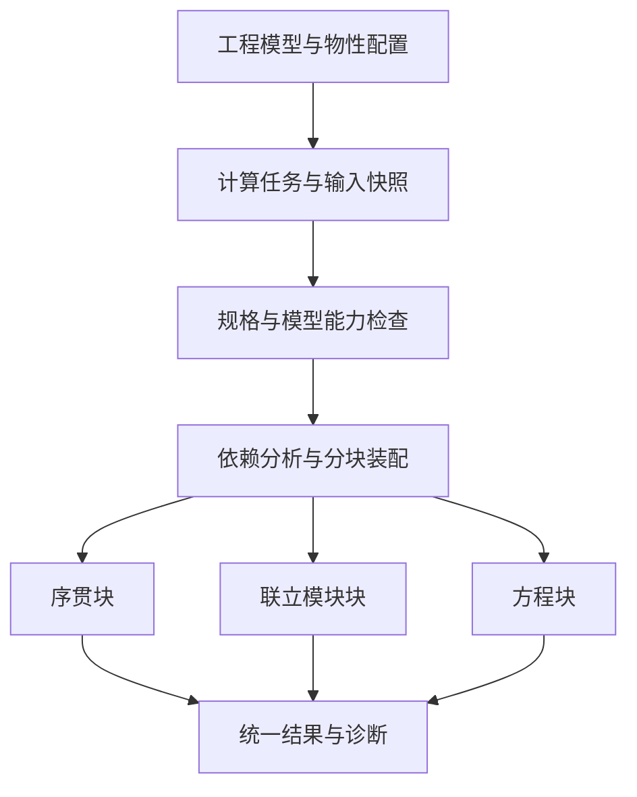

# 多策略求解与问题装配

更新时间：2026-09-29

## 用途与状态

用途：定义同一 PME 中序贯模块、联立模块、联立方程及混合分区的职责、能力契约、实施切片和验收。
读者：设计单元模型、物性、求解器、运行任务、诊断和外部组件适配的协作者。
不包含：具体 Rust trait、插件 ABI、数值库选型、项目 schema、自动策略选择算法或完整动态求解实现。

- 状态：Draft / 2026-09-29 方向已确认，新增能力待实施。
- 层级：二级功能；父专题为 [流程图建模与求解](../flowsheet-modeling-and-solve.md)。
- [平台总纲](../../architecture/simulation-platform.md#求解层级与数值策略) 拥有术语和总体分层；[模型目录专题](model-catalog-and-runtime.md) 拥有发现、实例与生命周期；本文拥有问题装配和多策略执行要求。
- 切片依赖归 [路线图](../../radishflow-mvp-roadmap.md#多策略求解的配套切片)，保持 [当前状态](../../status/current.md) 中的 U2 优先，不把完整多策略框架作为基础编辑前置。

## 目标与用户路径

同一工程使用相同设备、组分、物性和规格事实，根据模型能力形成不同计算问题。用户选择工况与任务，查看策略可用性及缺项，配置必要的初值和求解选项，运行后审阅统一结果和可定位诊断。比较策略时保留各次运行的身份与配置，不另建三套工程对象或设备库。

当前尚无三种模式的切换 UI。首个切片先支持明确范围的策略配置；自动选择和可视化分区按实际需要另行设计，不提供成功占位按钮。GUI、CLI 与未来自动化使用相同能力检查和运行语义。

## 当前实现

| 边界 | 当前事实 | 未实现部分 |
| --- | --- | --- |
| 流程求解 | `SequentialModularSolver` 按拓扑顺序执行，回路报错 | 撕裂 / recycle、联立模块、EO 与混合分区 |
| 单元 | `UnitOperation::run` 输入局部状态与服务，返回出口 | 模型残差、通用响应导数、方程元数据 |
| 热力学 | `ThermoProvider` 与 `TpFlashSolver` 支持简化物性和 TP 路径 | 通用求导契约、完整焓基准、PH / PS 与相态切换策略 |
| 运行与结果 | 同步求解，结果与文档修订分离 | 通用任务取消、多策略计划及迭代证据 |

代码入口：[solver](../../../crates/rf-solver/src/lib.rs)、[unitops](../../../crates/rf-unitops/src/lib.rs)、[thermo](../../../crates/rf-thermo/src/lib.rs)。既有模型的物理限制见 [热力学模型](../../thermo/mvp-model.md)，不因引入新求解器而消失。

## 三种策略与未知量边界

| 策略 | 单元内部 | 流程级问题 | 主要限制 |
| --- | --- | --- | --- |
| 序贯模块 SM | 单元用局部算法求出出口 | 按依赖执行；通过撕裂变量和规格迭代处理回路 | 强耦合可能反复计算；当前尚无回路收敛 |
| 联立模块 Simultaneous Modular | 通常保留局部求解，消去部分内部未知量 | 用模块响应、导数或近似关系联立调整边界变量和规格 | 依赖可重复求值、局部收敛与响应质量；不要求展开所有内部方程 |
| 联立方程 EO | 支持的模型暴露方程，选定内部未知量可进入全局问题 | 组装设备方程、连接约束和规格并求解 | 需要结构、缩放、初始化及有效导数；可保留隐式物性等子问题 |

以回流流程为例：SM 由一次顺序遍历得到 `r_calc = H(r)`，求回流残差 `H(r) - r = 0`；联立模块由局部响应 `y_i = G_i(x_i, p_i)` 形成选定耦合变量的 `R(z) = 0`；EO 则可把内部变量 `w_i` 连同 `F_i(w_i, x_i, y_i, p_i) = 0` 纳入装配。这里的符号是概念说明，不是接口定义。

三者有数学联系和不同消元方式。对撕裂变量使用 Newton 不自动改变 SM 的模型边界；联立模块不等于多线程并行；递归分块是执行组织，不等于联立求解。策略名称应对应实际未知量、方程和局部求解边界，不能只按算法名或迭代次数判定。

联立模块保留既有模块软件及其响应来处理流程耦合的依据见 [Mahalec 等，1979](https://www.sciencedirect.com/science/article/abs/pii/0098135479800587)。同一产品支持 SM / EO 的实践可参考 [Aspen 官方课程](https://esupport.aspentech.com/apex/T_course?id=a3p0B0000004YnpQAE)；不据此承诺任意单元可切换，也不预设某种策略一定更快。

## 工程、任务与问题装配

这是目标职责图，三条分支表示可选或混合执行，不表示默认同时运行三个求解器。

| 所有者 | 拥有的内容 | 边界 |
| --- | --- | --- |
| 工程模型 | 对象身份、物理模型引用、参数、连接、物性配置 | 不保存当前 Jacobian、迭代工作区或私有数值索引 |
| 计算任务 | 工况、输入快照、固定量 / 未知量、设计目标、策略与数值选项 | 不让试算反复写入活动文档或 Undo 历史 |
| 问题装配 | 变量 / 方程到工程对象的映射、连接约束、规格、结构与块边界 | 仅组装已声明且受支持的能力，不代写设备方程 |
| 执行计划与数值后端 | 块依赖、局部 / 耦合算法、工作区、容差、终止状态 | 不拥有第二份工程参数真相；数值索引只在相应运行有效 |
| 结果与诊断 | 输入修订、模型 / 数据版本、策略、有效性、残差及对象定位 | 只把满足发布条件的结果标为成功；迭代证据与最终结果分开 |

切换策略须重新检查能力、规格、边界条件、初始化和数值选项，并重建受影响的装配。固定变量不能同时作为无约束可调量；变量数与方程数相等不证明独立或可解，需相应结构检查和数值诊断。现有 readiness 和未来自由度检查的分工见 [规格专题](../modeling-assistance-and-specifications.md)。

先以简单局部求解或顺序遍历初始化是可选技术，不能把完整 SM 收敛作为所有 EO 问题的必要条件。初始化方法、失败、物性调用和耗时都应记录，不隐藏在主求解统计之外。结果保持同一物理量语义，但不同策略可有不同的内部变量与步骤证据，不强制伪造相同单元执行顺序。

## 模型能力契约

| 能力 | 服务的策略 | 最小语义要求 |
| --- | --- | --- |
| 局部求解 | SM、联立模块、初始化 | 输入 / 输出和规格明确，局部残差及失败原因可解释，可重复调用不污染输入 |
| 响应导数或方向导数 | 联立模块、灵敏度 | 相对于哪些独立变量、哪些量固定、组分约束、单位及精度明确 |
| 变量与方程残差 | EO | 稳定领域映射、边界、残差量纲、规格处理及支持范围明确 |
| 稀疏结构与求导能力 | EO、联立模块后端 | 声明可提供矩阵、方向乘积或可控差分等实际能力，不虚报完整解析 Jacobian |
| 初始化与状态管理 | 各策略 | 适用初值、可变工作区、失败恢复与安全停止边界明确 |

这些是能力分类，不是必须一次实现的巨大 trait。能力是否足够由所选装配和后端判断；不支持时明确拒绝，不能静默换物理模型。具体导数采用解析、自动微分、数值差分或近似更新，按模型和基准决定。

自有模型的局部求解和方程表达应共享物理关系、参数、参考态和适用域，避免分别维护物理含义不同的 SM / EO 版本；不要求所有模型使用同一种表达框架。外部黑箱只声明真实提供的能力。目录记录能力，装配器消费能力，具体模型负责方程与校验，三者不互相复制规则。

局部隐式求解的输出导数需要包含内部状态对输入的响应，不能把内部收敛状态固定后得到的偏导当完整响应。差分须规定扰动、变量缩放、边界处理、内层误差与重复性；内层精度应足以支持外层残差 / 导数要求，不能外层显示收敛而内层仍有显著误差。

## 分块与混合执行

分块和块内策略分别决定。可以先按依赖执行序贯预处理，再进入联立模块回流块、EO 设备组及外部局部单元；这些块之间若形成回路，就必须在更高层或合并后的耦合问题中收敛，不能执行一遍后提交。

- 依赖包括物料、能量、压力关系、控制 / 设计规格与实际共享未知量；不能只依据物流箭头或画布分组。
- SM / 模块式路径可先分析有向依赖与强连通分量；EO 还需变量—方程关联、结构匹配等分析，不把物流图的强连通分量当作完整方程结构。
- 分区需定义交换变量、固定 / 自由量、单位 / 焓基准、边界残差和状态有效性。明确变量消去或连接约束的选择，避免重复施加约束或漏掉未知量。
- 子块结果只有满足局部及外层耦合条件后才成为相应范围的有效结果。未收敛、超域和局部失败传播到具体块、变量与工程对象，不用上次成功值伪造本次结果。
- 并行执行另依赖数据独立性、线程安全与可重入性；CAPE-OPEN 或其他黑箱的串行约束必须保持。

计划重建、暂停 / 取消、旧结果拒绝与事件呈现复用 [运行诊断专题](../runtime-messages-and-diagnostics.md)。首版只承诺真实可用的控制粒度，不能在无法中断的组件调用中宣称已安全停止。

## 热力学与外部组件

物性求值 / 导数、相态处理和试算状态要求归 [热力学边界](../../thermo/mvp-model.md#多策略求解的热力学要求规划)；包解析和任务上下文归 [物性配置专题](../property-basis-and-components.md#物性配置与运行上下文规划)。EO 不要求每次迭代先把所有物流完全闪蒸收敛，也不表示可以接受任意越过物性适用域的求值。

只有局部 `Calculate()` 的外部组件可在受控条件下提供响应或封装为 `y - G(x) = 0`，但不能因此宣称获得其内部方程。可重复性、导数、引用 / 状态隔离和错误映射等约束归 [CAPE-OPEN 黑箱边界](../../capeopen/boundary.md#黑箱组件与多策略求解)。普通 Unit Operation 接口与方程集合能力分别验收。

## 分阶段切片

| 切片 | 范围 | 退出标准 |
| --- | --- | --- |
| QS0 问题与契约 | 选定首个物理案例，确定未知量、规格、能力、初始化与独立基准 | 明确模型版本、有效域、失败场景与比较指标，审定所需接口 / 存储影响 |
| QS1 分块 SM 与循环 | 从无回路顺序执行扩展到实际依赖分块、撕裂和局部收敛 | 已知回流解、残差 / 衡算、边界与失败传播正确；不以达到迭代次数作为成功 |
| QS2 首个联立模块块 | 以真实耦合案例组装边界残差，控制局部精度并获取响应 | 与同模型参考解一致；完整统计总耗时、模块 / 物性调用、失败率及初始化成本 |
| QS3 首个 EO 块 | 小型模型组的方程、连接、结构、缩放、导数与初始化 | 与独立基准和支持的局部求解一致；错误规格、奇异结构和超域可诊断 |
| QS4 混合分区 | 组合已验证的序贯、联立模块、方程块及按需引入的黑箱 | 跨块回路与残差正确，结果和失败身份一致；不支持的组合明确拒绝 |

QS1 归 P3；QS2 / QS3 归 P4，可在各自前置能力具备后分别实施，不要求先完成全部设备或全部联立模块。QS4 只组合已验证的能力。QS0 按案例重复细化；MC0—MC2 提供必要模型和物性装配，完整动态、插件市场和通用 SDK 不作为前置。

## 验收与验证矩阵

| 场景 | 必须观察的结果 |
| --- | --- |
| 无回路回归 | 现有六类单元的合法 / 非法输入和结果传递保持；已有演示测试不升级为物理基准 |
| 回流与规格 | 有独立期望的回路、耦合规格和跨分区回路满足缩放后残差及物料 / 能量衡算；不收敛明确失败 |
| 策略一致性 | 同一物理模型、物性版本、规格与解分支下，在说明的容差内一致；多根选择记录初值与分支，不声称任意初值同解 |
| 结构与能力拒绝 | 欠 / 过规格、相关方程、不支持导数 / 相态 / 策略、缺物性与数值失败分别诊断；未知结构不伪报零自由度 |
| 导数与内层精度 | 在适用域内对照独立扰动与不同步长；检验缩放及局部误差对外层结果的影响，相界不假定光滑 |
| 状态与恢复 | 试算不污染文档、入口或其他任务；失败 / 取消 / 策略变化不误提交结果；物理输入修订后旧结果失效 |
| 性能与鲁棒性 | 对固定硬件 / 版本 / 容差和案例集统计总耗时、调用量、初始化、成功率及残差；不以外层迭代更少推导更快 |
| 外部与界面 | 黑箱重复调用和释放可验证；GUI / CLI 返回同一结论；内部方程与失败能定位工程对象，不能只报数值索引 |

文档阶段执行治理、链接、文本和体量检查；实现阶段按切片补定向数值 / 故障测试和必要跨层基线。每个物理案例的独立依据、适用域和误差由相应模型专题维护，策略测试不以同源 golden 替代物理验证。

## 实施前待决策

- 首个 QS1—QS3 工况、可信物性与规格、独立基准和容差依据。
- 模型能力接口、变量 / 方程身份、单位 / 基准、缩放和结构分析表示。
- 初始化、局部 / 外层误差、稀疏求导与数值后端选型及失败恢复策略。
- 策略选项、运行证据和重开复现的存储范围；当前工程格式不因本文改变。
- 相态变化与非光滑处理、黑箱状态隔离及性能门槛；自动分区 / 策略选择另按需求审定。

方向确认不等于上述技术选择已冻结。近期继续基础功能，按真实模型需求进入 QS0。
